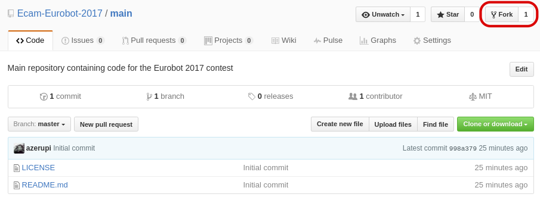

# ECAM - Eurobot 2017

## Documentation
La documentation du projet et autre littérature se trouve sous le dossier `doc/`

## Contribution
Pour assurer un certain contrôle de qualité et de cohésion dans le code, chaque contribution doit être relue et approuvée par un membre de la team des **reviewers**. Personne n'as les droits pour faire des commits directement sur le repository. C'est pour celà que chacun doit créer une copie personelle du repo *(= un fork)* sur lequel il peut faire des commits. Une fois que la modification est prête à être intégrée dans le code original, il suffira de créer un **Pull-Request** pour que la modification puisse être relue et intégrée.

Les étapes à suivrent sont les suivantes:

1. Créer un **fork** du repository.
  

2. Vous aller avoir une copie du repository sous votre namespace personel que vous aller pouvoir cloner. Vérifier bien que le repository que vous regarder est le fork sous votre nom et pas l'original. Ensuite, appuyer sur le bouton **Clone or download** en vert. Copier le lien qui apparait.
  

3. Ouvrez un terminal et tapez la commande suivant, en remplaçant `<lien>` par le lien que vous venez de copier:
  ```
  git clone <lien>
  ```

4. Le repository devrait être cloné sur votre ordinateur. Vous pouvez faire vos modifications. Une fois terminer, vous devez faire un commit des changements.   
  ```
  git add .
  git commit -m "Message de commit"
  git push
  ```
5. Une fois que les modifications sont sur votre fork sur GitHub, vous pouvez faire un **Pull-Request**
  

## License
Tout le code dans ce repository est disponible sous la [license MIT](LICENSE)
