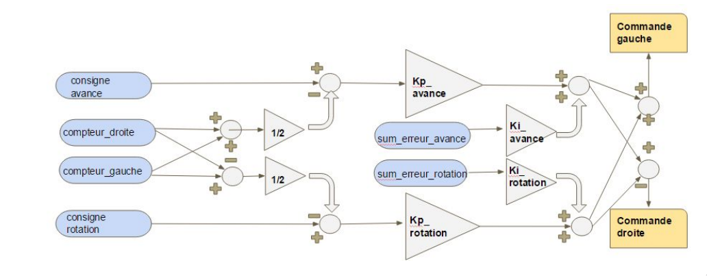

# La régulation

> Pour comprendre la régulation plus en profondeurs, je vous invite à lire le
[code](https://github.com/Ecam-Eurobot-2017/main/tree/master/code/arduino/motors) après avoir lu
ce petit tutoriel. Celui-ci devrait être plutot clair.

## Introduction

La régulation va permettre deux choses pour votre prochain robot:

- Avancer droit/Tourner correctement
- Donner des consignes de position/rotation que le robot doit effectué

Le code de la régulation est composé en 2 parties distinctes:

- La partie Arduino qui effectue la régulation à proprement parlé.
- La partie RaspberryPi qui demande l'execution de certaines commandes telles
    que avance de X cm, tourne de X°, etc mais aussi des demandes d'informations/status
    de la régulation. Exemple: Est-ce que la régulation est finie? Quels sont
    la distance parcouru par les odomètres? etc

## Régulation de position

La régulation de position permet de donner une consigne à atteindre pour le robot.
Le robot ne peut donc que avancer, reculer et tourner (d'autres mouvements sont possibles avec
d'autres régulations (voir Améliorations)).



Le schéma de régulation présenté ci-dessus représente une régulation PI. Un PI suffit largement par
rapport à un PID qui apporterait plus d'instabilités au système. Dans cette régulation, nous pouvons
voir 2 différentes parties:

- la régulation d'avance
- la régulation de rotation

Dès que nous devons avancer, la rotation doit bien sur être égale à 0 et inversement pour la
rotation. [Le code de régulation](https://github.com/Ecam-Eurobot-2017/main/tree/master/code/arduino/motors)
contient bien sur la régulation présenté ci-dessus mais aussi d'autres petites améliorations pour
augmenter la vitesse d'arrivée à la consigne. Le lecteur est invité à lire les commentaires pour
comprendre plus en profondeurs ces améliorations (ou contacter @charlesvdv si jamais).

## Tester la régulation

Tester la régulation permet de *fine-tune* les paramètres de régulations afin d'arriver à la
consigne plus rapidement. Ce test peut s'effectuer directement sur l'Arduino dans un premier temps
en ajoutant ces lignes de codes:

```arduino
void setup {
    // the code in the setup function

    regulation = new LeadRegulation(&motor_left, &motor_right);
    // Move 50cm forward
    regulation->set_setpoint(Motor::convert_cm_to_imp(50));

    // Turn left or right (depends on the sign).
    // regulation = new RotationRegulation(&motor_left, &motor_right);
    // regulation->set_setpoint(Motor::convert_angle_to_imp(angle));
}
```

Pour tester des séquences plus complexes, vous aurez besoin d'utiliser une autre carte communicant
en I2C. Dans notre cas, nous avons utilisés une RaspberryPi utilisant notre protocol I2C. [Notre
script](https://github.com/Ecam-Eurobot-2017/main/pull/19/commits/99c1717fc9773832cd3b58d266e74c499d75b86b)
fait effectué au robot un carré finissant par un tour sur lui-meme. Ce script avec un timer permet
facilement de detecter les regressions et les améliorations dans la régulation.

### Améliorer les paramètres de régulations

Le robot a du mal à atteindre sa consigne ?

> Surement un manque de facteurs intégrales et/ou de facteurs proportionnels

Le robot overshoot ?

> Essaye de diminuer le facteur intégral.

## Améliorations

- Une régulation en vitesse pour pouvoir avancer et tourner en meme temps !!
